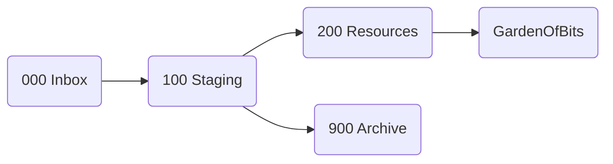

---
{"dg-publish":true,"dg-path":"Gardens/Meta/My Second Brain.md","permalink":"/gardens/meta/my-second-brain/","tags":["second-brain","pkm","obsidian"],"noteIcon":"1","created":"","updated":""}
---

# My Second Brain

## Second Brain Setup
My personal [[GOB/Meta/Second Brain\|Second Brain]] was built on [uwidev/memory-flow-interface](https://github.com/uwidev/memory-flow-interface). It's a template for a basic Obsidian working environment. Blessings to you, [uwi](https://github.com/uwidev).

My Second Brain has 3 purposes:
1. Planning & Getting Things Done
2. Knowledge Generation
3. Journaling & Alignment

The [Memory Flow Interface](https://github.com/uwidev/memory-flow-interface/blob/main/00%20%E2%99%BB%20Memory%20Flow%20Interface.md) is "...designed to be powerfully basic. The core elements allow for immense personal development and information management."

### Directory structure

I use a rather simple directory structure.
```bash
.  
├── 000 Inbox  
├── 100 Staging  
├── 200 Resources  
├── 300 Alignment  
├── 500 Dashboards  
├── 700 Media  
├── 800 Templates  
├── 900 Archive  
├── 999 GardenOfBits
└── README.md
```

> [!NOTE] Numbering
> The numbering of the directories is arbitrary and does not follow any rules.

I only have 1 file in the root folder called `README.md`, but all other containers are folders. I use [Folders as Working States](https://github.com/uwidev/memory-flow-interface/blob/main/200%20Resources/Folders%20as%20Working%20States.md) for notes. This is the usual pipeline for new notes:



#### Special directories

There are some special directories:
- `400 Alignment` -> for keeping retrospective notes and journals in a chronological folder structure
- `500 Dashboards` -> contains dashboard notes
- `700 Media` -> contains all kind of media files (PDFs, PNGs, etc.)
- `800 Templates` -> contains Obsidian note templates (used by [Templates Core Plugin](https://help.obsidian.md/Plugins/Templates) and [Templater Community Plugin](https://github.com/SilentVoid13/Templater)).

As `uwi` and so many others have correctly figured out before, using directories for organizing notes, is not a best practice. You will soon find out that a note e.g. Python certification can go both in "technologies" folder and the "career" folder too. [Tags](https://github.com/uwidev/memory-flow-interface/blob/main/200%20Resources/Tags.md) for the rescue. A note can have multiple tags, but it can only ever have 1 parent folder.

Tasks TODO

Projects TODO

Disciplines & PPV

## Obsidian plugins I use
# Workflow

### **CRE** Framework - a simplified [[200 Resources/CODE Framework\|CODE Framework]] 

#### Connect
Whenever collect, connect right away! 

see: [[GOB/Meta/Linking your thinking\|Linking your thinking]], [[200 Resources/201 Memory Flow Interface/Rambling\|Rambling]]

#### Refactor
Has both order and distill in it. And ultimately should minimize this stage.

#### Express 
[[GOB/Garden of Bits\|Garden of Bits]], [[000 Inbox/Blogging\|Blogging]], [[000 Inbox/Content Creation\|Content Creation]], [[200 Resources/201 Memory Flow Interface/Alignment\|Alignment]]


