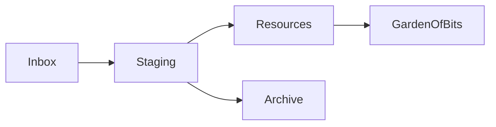

---
{"dg-publish":true,"dg-path":"Gardens/Meta/My Second Brain.md","permalink":"/gardens/meta/my-second-brain/","tags":["second-brain","pkm","obsidian"],"noteIcon":"1","created":"","updated":""}
---

# My Second Brain

## Second Brain Setup
My personal [[GOB/Meta/Second Brain\|Second Brain]] was built on [uwidev/memory-flow-interface](https://github.com/uwidev/memory-flow-interface). It's a template for a basic Obsidian working environment. Blessings to you, [uwi](https://github.com/uwidev).

My Second Brain has 3 purposes:
1. Planning & Getting Things Done
2. Knowledge Generation
3. Journaling & Alignment

The [Memory Flow Interface](https://github.com/uwidev/memory-flow-interface/blob/main/00%20%E2%99%BB%20Memory%20Flow%20Interface.md) is "...designed to be powerfully basic. The core elements allow for immense personal development and information management."

I use a rather simple directory structure:
```bash
.  
├── 000 Inbox  
├── 100 Staging  
├── 200 Resources  
├── 300 Alignment  
├── 500 Dashboards  
├── 700 Media  
├── 800 Templates  
├── 900 Archive  
├── 999 GardenOfBits
└── README.md
```

I only have 1 file in the root folder called `README.md`, but all other containers are folders. I use [Folders as Working States](https://github.com/uwidev/memory-flow-interface/blob/main/200%20Resources/Folders%20as%20Working%20States.md) for notes. This is the 

`Inbox` -> `Staging` -> `Resources`/`Archive` -> `GardenOfBits`



As `uwi` correctly figured out


# How do I work with Second Brain?

### **CRE** Framework - a simplified [[200 Resources/CODE Framework\|CODE Framework]] 

#### Connect
Whenever collect, connect right away! 

see: [[GOB/Meta/Linking your thinking\|Linking your thinking]], [[200 Resources/201 Memory Flow Interface/Rambling\|Rambling]]

#### Refactor
Has both order and distill in it. And ultimately should minimize this stage.

#### Express 
[[GOB/Garden of Bits\|Garden of Bits]], [[000 Inbox/Blogging\|Blogging]], [[000 Inbox/Content Creation\|Content Creation]], [[200 Resources/201 Memory Flow Interface/Alignment\|Alignment]]


